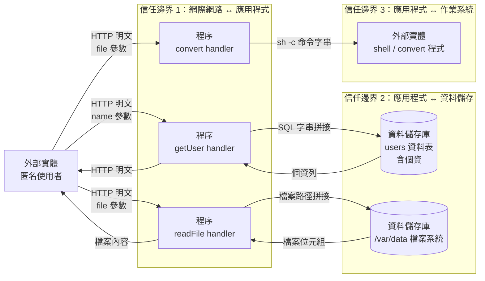

# 威脅建模

| 項目 | 內容 |
|---|---|
| 對象 | `security-compliance-tw/testdata/sample-go`（`main.go` 41 行） |
| 安全分級 | 中（假設） |
| 方法 | 資料流程圖 → STRIDE → DREAD → 控制措施對應 |
| 資料來源 | `security-audit/findings.md`（2026-08-22 第二輪） |
| 建模日期 | 2026-08-22 |

**DREAD 算法：五維相加 D+R+E+A+Di，區間 12–15 高 / 8–11 中 / 5–7 低。**
（依《安全軟體設計參考指引》表 12 範例。該指引內文另載乘法公式
`(R+E+Di)×(D+A)`，但範例表使用相加，且僅相加法有明確定義的分級區間。
《安全軟體發展流程指引》表 9 則使用乘法。**驗算時請依本表所載算法。**）

---

## 1. 系統概述與範圍

單一 Go 程序，對外提供三個 HTTP 端點，無身分機制、無 session、無 Cookie。

| 端點 | 功能 | 觸及的資產 |
|---|---|---|
| `/user?name=` | 依名稱查詢使用者 | `users` 資料表（**含個資**） |
| `/convert?file=` | 呼叫外部程式轉檔 | 作業系統 shell |
| `/file?file=` | 讀取並回傳檔案 | `/var/data` 檔案系統 |

**範圍內**：應用程式源碼。
**範圍外**：資料庫本身的組態、主機加固、網路架構、`convert` 外部程式的安全性。

## 2. 資料流程圖

## 3. 信任邊界說明

| 邊界 | 跨越的資料 | 現況 |
|---|---|---|
| **TB1** 網際網路 ↔ 應用程式 | 三個 query 參數 | **完全無驗證**。無身分鑑別、無格式檢查、無長度限制 |
| **TB2** 應用程式 ↔ 資料儲存 | SQL 敘述、檔案路徑 | **參數直接進入敘述**。無參數化、無路徑正規化 |
| **TB3** 應用程式 ↔ 作業系統 | shell 命令字串 | **經 `sh -c` 執行**，metacharacter 可逃逸 |

三條邊界全部沒有防護，這是本系統威脅集中的根因。

## 4. 威脅清單（STRIDE）

| 編號 | 威脅 | STRIDE | 元素 | 來源 check |
|---|---|---|---|---|
| T1 | 經查詢介面注入 SQL，取出 `users` 全表個資 | T · I | 程序 / 資料儲存庫 | SAST-INJ-001 |
| T2 | 經轉檔介面注入 shell 命令，取得主機執行權 | E · T · I | 程序 / 外部實體 | SAST-INJ-002 |
| T3 | 經檔案介面尋訪路徑，讀取系統任意檔案 | I | 程序 / 資料儲存庫 | SAST-INJ-003 |
| T4 | 未經授權直接存取個資查詢介面 | S · I | 外部實體 / 程序 | SAST-AUTHZ-001 |
| T5 | 明文傳輸遭網路路徑上竊聽，取得個資 | I | 資料流 | DAST-TLS-001 |
| T6 | 無稽核紀錄，事後無法證明誰做了什麼 | R | 程序 / 資料儲存庫 | SAST-LOG-003 |
| T7 | 觸發資料庫失敗導致 nil 解參考 panic，服務中斷 | D | 程序 | SAST-ERR-002 |
| T8 | 頁面遭嵌入 iframe，誘導使用者誤操作 | T | 資料流 | DAST-HDR-003 |

**全部八項均對應 `findings.md` 中已證實存在的問題**，非推測。

## 5. DREAD 評分與排序

信心度標示：**高**＝程式碼看得出來；**中**＝部分可推導；**低**＝需業務脈絡，此處為假設值。

| # | 威脅 | D | R | E | A | Di | 風險值 | 等級 |
|---|---|:-:|:-:|:-:|:-:|:-:|:-:|:-:|
| T1 | SQL 注入取全表個資 | 3 | 3 | 3 | 3 | 3 | **15** | 高 |
| T4 | 未授權存取個資介面 | 3 | 3 | 3 | 3 | 3 | **15** | 高 |
| T2 | OS 命令注入取得主機權限 | 3 | 3 | 3 | 3 | 2 | **14** | 高 |
| T3 | 路徑尋訪讀取任意檔案 | 2 | 3 | 3 | 2 | 2 | **12** | 高 |
| T5 | 明文傳輸遭竊聽 | 3 | 2 | 2 | 2 | 3 | **12** | 高 |
| T6 | 無稽核無法歸責 | 1 | 3 | 3 | 3 | 1 | **11** | 中 |
| T7 | nil panic 導致服務中斷 | 1 | 3 | 2 | 3 | 2 | **11** | 中 |
| T8 | 點擊劫持 | 1 | 3 | 2 | 2 | 3 | **11** | 中 |

### 各維度信心度與假設

| # | 低信心欄位 | 採用的假設 | 使用者應確認什麼 |
|---|---|---|---|
| T1 | D · A | `users` 表含完整個資、全體使用者資料在同一表 | 該表實際欄位與資料筆數 |
| T2 | D · A | 程序以可觀權限執行、主機淪陷影響全體服務 | **程序實際執行身分**（第 5 項查檢表同此） |
| T3 | D · A | 可讀取設定檔但非全系統、僅影響該端點使用者 | `/var/data` 鄰近目錄有何機敏檔案 |
| T4 | D · A | 同 T1 | 同 T1；以及該端點是否本應公開 |
| T5 | D · A | 傳輸內容含個資、僅網路路徑上的使用者受影響 | 部署網路環境（內網／公網／有無 LB 終結 TLS） |
| T6 | A | 影響全體事件的可追溯性 | 法規對日誌保存的具體要求 |
| T7 | A | 服務為單一實例，panic 即全斷 | 是否有多實例或自動重啟 |
| T8 | A | 僅影響互動式頁面使用者 | 是否有需保護的互動操作 |

**中信心欄位**：T1–T5 的 Di（端點是否公開可枚舉看得出來，但手法是否已被針對性揭露看不出來）、
T7 的 E 與 A。

**高信心欄位**：全部八項的 R 與 E（除 T7 的 E）——這兩維由漏洞類型與是否需登入決定，
程式碼可直接判定。

## 6. 威脅與控制措施對應

| # | 風險 | 控制措施 | 狀態 |
|---|:-:|---|---|
| T1 | 高 | 改用驅動層 placeholder：`db.Query("... WHERE name = ?", name)` | 未修補（`sample-go-fixed` 已示範） |
| T4 | 高 | ①導入身分機制 ②建立單一具名授權入口 ③查詢帶入 `owner_id` 條件 | **未修補——需求層決策** |
| T2 | 高 | 不經 shell，argv 逐一傳入：`exec.Command("convert", target, "out.png")` | 未修補（`sample-go-fixed` 已示範） |
| T3 | 高 | 正規化 → 根目錄前綴比對 → 才開檔（順序不可顛倒） | 未修補（`sample-go-fixed` 已示範） |
| T5 | 高 | 改用 `ListenAndServeTLS`，`MinVersion: TLS1.2`，明列 AEAD 套件 | 未修補。**若 TLS 由 LB 終結，改在 LB 設定** |
| T6 | 中 | 集中式 `Audit()` 進入點，五要素固定；同步套用 `sanitizeForLog` 避免觸發日誌注入 | 未修補 |
| T7 | 中 | `if err != nil` 檢查後才 `defer rows.Close()` | 未修補 |
| T8 | 中 | 安全標頭 middleware 包在 mux 外層，`X-Frame-Options` 與 CSP `frame-ancestors` 兩者都設 | 未修補 |

T4 一項控制措施不足以降低風險，需三項並行。

## 7. 待人工確認事項彙整

### A. 影響評分準確度（8 項威脅的 D 與 A 維度）

見第 5 節「各維度信心度與假設」表。**這些是假設值**，
確認後風險排序可能改變——尤其 T2：若程序以 root 執行，D 應維持 3；
若以受限使用者執行且無 sudo，D 可降至 2，T2 將由 14 降為 13（仍為高）。

### B. 需業務決策

1. **`/user` 是否應受身分保護**——決定 T4 的處置方向，也連帶影響 T1 的實際衝擊
2. **部署網路環境**——決定 T5 的修補位置（應用程式端或 LB）

### C. 範圍外但相關

- `convert` 外部程式本身的安全性（T2 修補後仍存在的殘餘風險）
- 資料庫帳號權限（T1 修補後，若 DB 帳號仍有 `DROP` 權限，殘餘風險偏高）

## 8. 驗算紀錄

| # | D+R+E+A+Di | 風險值欄 | 等級判定 | 一致 |
|---|---|:-:|---|:-:|
| T1 | 3+3+3+3+3 = 15 | 15 | 12–15 → 高 | ✓ |
| T4 | 3+3+3+3+3 = 15 | 15 | 12–15 → 高 | ✓ |
| T2 | 3+3+3+3+2 = 14 | 14 | 12–15 → 高 | ✓ |
| T3 | 2+3+3+2+2 = 12 | 12 | 12–15 → 高 | ✓ |
| T5 | 3+2+2+2+3 = 12 | 12 | 12–15 → 高 | ✓ |
| T6 | 1+3+3+3+1 = 11 | 11 | 8–11 → 中 | ✓ |
| T7 | 1+3+2+3+2 = 11 | 11 | 8–11 → 中 | ✓ |
| T8 | 1+3+2+2+3 = 11 | 11 | 8–11 → 中 | ✓ |

八項全部一致。
